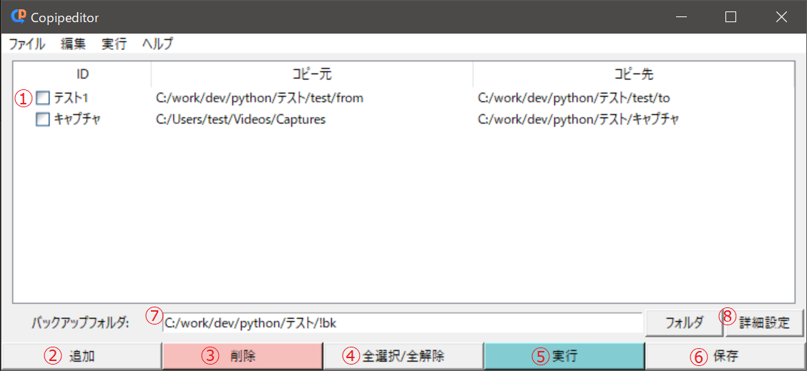

# Copipeditor
Copipeditor(コピペディター)は定型的なコピペ作業をサポートするアプリです。

# できること
1. GUIから一括でフォルダからフォルダへのコピー処理を実行
2. コマンドラインから実行
3. コピー時の重複ファイルを別フォルダにバックアップ
4. 実行結果をテキストファイルとして出力

# リンク
使い方は下記リンクをご参照ください。

[Github Pages](https://yt3trees.github.io/Copipeditor/)

# License
This software is released under the MIT License.

Copyright (c) 2021 yt3trees
