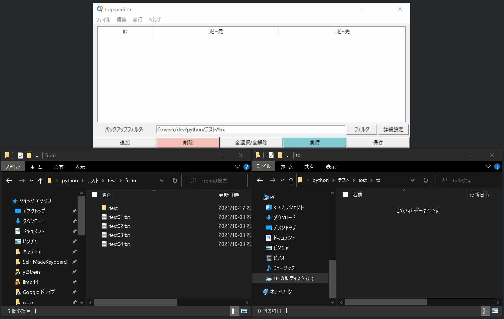
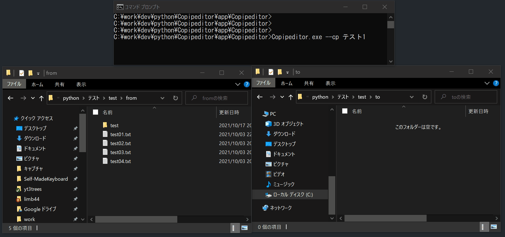

# Welcome to Copipeditor!
Copipeditor(コピペディター)は定型的なコピペ作業をサポートするアプリです。

<!--


-->

## できること

### 1. GUIから一括でフォルダからフォルダへのコピー処理を実行
GUIでコピーしたいフォルダのパスを登録し、Copipeditor上で実行することができます。

複数コピー処理を一括で行うことも可能です。



### 2. コマンドラインから実行
Copipeditorはコマンドライン引数を渡すことでコピーを実行することができます。

バッチファイルで実行できるため、タスクスケジューラ等を用いることで時間指定や定期的なコピー処理を行えます。

引数については[説明ページ](https://yt3trees.github.io/Copipeditor/documentation/commandline.html)をご確認ください。



### 3. コピー時の重複ファイルを別フォルダにバックアップ
コピー先に同じ名前のファイルが存在する場合は別フォルダにバックアップした上で上書きします。

### 4. 実行結果をテキストファイルとして出力
コピー処理の結果をテキストファイルとして出力します。
```
yyyy-mm-dd hh:mm
INFO:components.CopyProcess:>>コピー処理を開始します。
INFO:components.CopyProcess:>>実行対象:テスト1
INFO:components.CopyProcess:----------
INFO:components.CopyProcess:■処理アイテム:テスト1
INFO:components.CopyProcess:
INFO:components.CopyProcess:C:/work/dev/python/テスト/test/from\test01.txtから
INFO:components.CopyProcess:C:/work/dev/python/テスト/test/to\test01.txtにコピーします。
INFO:components.CopyProcess:コピー先重複ファイルをC:/work/dev/python/テスト/!bk/yyyymmddhhmm_テスト1/Before/test01.txtにバックアップしました。
INFO:components.CopyProcess:
INFO:components.CopyProcess:C:/work/dev/python/テスト/test/from\test02.txtから
INFO:components.CopyProcess:C:/work/dev/python/テスト/test/to\test02.txtにコピーします。
INFO:components.CopyProcess:
INFO:components.CopyProcess:C:/work/dev/python/テスト/test/from\test03.txtから
INFO:components.CopyProcess:C:/work/dev/python/テスト/test/to\test03.txtにコピーします。
INFO:components.CopyProcess:
INFO:components.CopyProcess:C:/work/dev/python/テスト/test/from\test04.txtから
INFO:components.CopyProcess:C:/work/dev/python/テスト/test/to\test04.txtにコピーします。
INFO:components.CopyProcess:
INFO:components.CopyProcess:C:/work/dev/python/テスト/test/from\test\test04.txtから
INFO:components.CopyProcess:C:/work/dev/python/テスト/test/to\test\test04.txtにコピーします。
INFO:components.CopyProcess:
INFO:components.CopyProcess:C:/work/dev/python/テスト/test/from\test\test05.txtから
INFO:components.CopyProcess:C:/work/dev/python/テスト/test/to\test\test05.txtにコピーします。
INFO:components.CopyProcess:
INFO:components.CopyProcess:>>コピー元ファイルをバックアップしました。C:/work/dev/python/テスト/test/from -> C:/work/dev/python/テスト/!bk/yyyymmddhhmm_テスト1/After
INFO:components.CopyProcess:
INFO:components.CopyProcess:>>ファイルをコピーしました。C:/work/dev/python/テスト/test/from -> C:/work/dev/python/テスト/test/to
INFO:components.CopyProcess:----------
INFO:components.CopyProcess:>>処理が完了しました。
```


## ダウンロード

下記リンクからzipをダウンロードできます。

[Releases](https://github.com/yt3trees/Copipeditor/releases)

インストール不要です。デスクトップや`C:\Program Files`等お好みの場所においてご使用ください。
