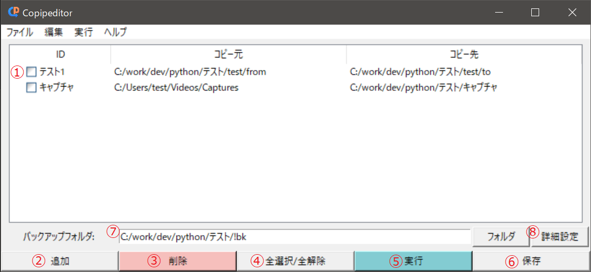

# GUI操作

1. **アイテム**<br>
コピー処理対象のフォルダパス情報です。ダブルクリックすることでパス入力ウィンドウが表示され、
パスの登録・変更を行えます。

2. **追加ボタン**<br>
アイテムを追加します。

3. **削除ボタン**<br>
チェックを入れているアイテムを削除します。

4. **全選択/全解除ボタン**<br>
全てのアイテムのチェックボックスをオンにします。全てチェックオンの場合は全てのチェックをオフにします。

5. **実行ボタン**<br>
チェックが入っているアイテムのコピー処理を実行します。

6. **保存ボタン**<br>
登録したアイテム情報を保存します。

7. **バックアップフォルダパス**<br>
コピー時のバックアップファイルの置き場所を入力します。

8. **詳細設定ボタン**<br>
詳細設定ウィンドウを開きます。

## パス入力ウィンドウ

- **ID**<br>
アイテムを一意に識別するためのID入力欄です。

- **コピー元**<br>
コピーしたいフォルダのパスを入力する欄です。

- **コピー先**<br>
コピー先のフォルダのパスを入力する欄です。

## 詳細設定ウィンドウ

- **バックアップする**<br>
チェックオンの場合は、コピー時にコピー元ファイルとコピー先の重複ファイルをバックアップします。

- **コピー元ファイル削除**<br>
チェックオンの場合は、コピー後コピー元フォルダ内のファイルを削除します。
```warning
バックアップ無しでコピー先に重複ファイルがあった場合、そのファイルは上書きされるため完全に消失します。
```